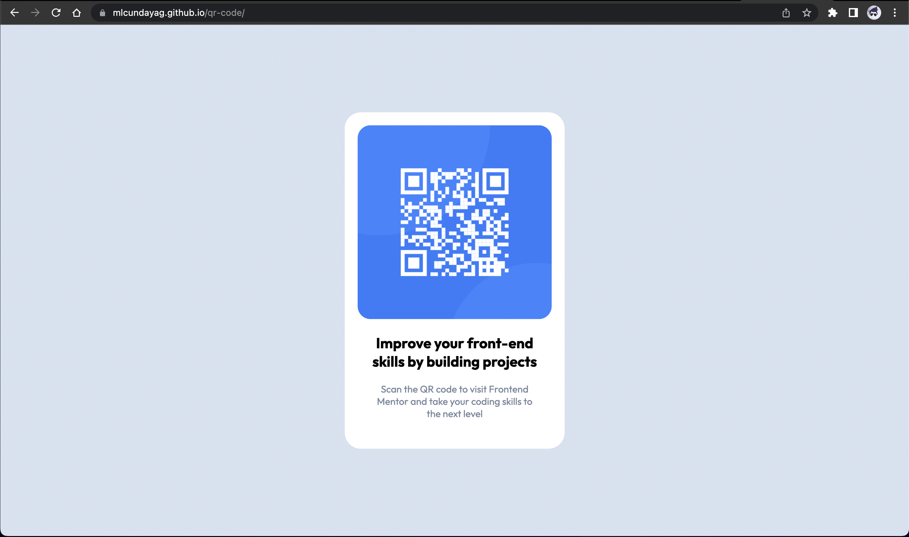

# Frontend Mentor - QR code component solution

This is a solution to the [QR code component challenge on Frontend Mentor](https://www.frontendmentor.io/challenges/qr-code-component-iux_sIO_H). Frontend Mentor challenges help you improve your coding skills by building realistic projects. 

## Table of contents

- [Overview](#overview)
  - [Screenshot](#screenshot)
  - [Links](#links)
- [My process](#my-process)
  - [Built with](#built-with)
  - [What I learned](#what-i-learned)
  - [Continued development](#continued-development)
- [Author](#author)

## Overview

### Screenshot



### Links

- Solution URL: [Add solution URL here](https://github.com/mlcundayag/qr-code)
- Live Site URL: [Add live site URL here](https://mlcundayag.github.io/qr-code/)

## My process

### Built with

- Semantic HTML5 markup
- CSS custom properties
- Flexbox

### What I learned

I learned how to center and position my objects in the webpage.

```html
<main class="container">
    <div class="card">
      <div class="image-card">
        
      </div>
      <div class="text-container">
        <h2 class="caption">Improve your front-end skills by building projects</h2>
        <p class="text">Scan the QR code to visit Frontend Mentor and take your coding skills to the next level</p>
      </div>
    </div>
  </main>
```
```css
.container {
    background-color: hsl(0, 0%, 100%);
    position: fixed;
    top: 50%;
    left: 50%;
    transform: translate(-50%, -50%);
    border-radius: 25px;
}
```

### Continued development

In the future I would like to explore grid system and be able to use it to position things. I would also incorporate a css framework to easily manipulate objects and position things. 

## Author

- GitHub - [mlcundayag](https://github.com/mlcundayag/)
- Frontend Mentor - [@mlcundayag](https://www.frontendmentor.io/profile/mlcundayag)
